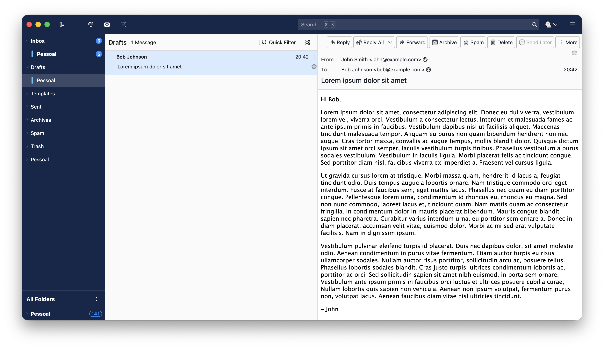

# Thunderbird Modern Theme

A `userChrome.css` that gives Thunderbird a cleaner, flatter, Spark-inspired look:

- Dark blue folder sidebar with white text, no folder icons, subtle chevrons and full-width rows
- Dark blue top toolbar that matches the sidebar
- Message cards stacked edge to edge, separated by a thin line
- Flat blue "unread" dot

<p align="center">
  
</p>

> Tested on **Thunderbird 156** on **macOS**. Other versions and platforms are untested.
> This theme overrides Thunderbird's internal CSS, so a major Thunderbird update can break it.

## Requirements

This theme is designed for a specific setup. Without it, parts of the theme will not apply or will look off.

### 1. Enable `userChrome.css` support

Thunderbird ignores `userChrome.css` by default.

1. Open **Settings → General → Config Editor** (at the bottom).
2. Search for `toolkit.legacyUserProfileCustomizations.stylesheets`.
3. Set it to `true`.

### 2. Use the Cards View

The message list styling (edge-to-edge cards, thin separators) only targets the **Cards View**. In Table View only the blue unread dot is restyled.

1. In the message list header, open the display options menu.
2. Choose **Cards View**.

### 3. Show Unified Folders (with the Unified Inbox), on top

The theme is meant to be used with the **Unified Folders** mode, which contains the Unified Inbox, placed **above** All Folders.

1. Open the folder pane **⋯ (More)** menu → **Folder Modes**. If you can't see the ⋯ button, see [Hide the Folder Pane Header](#recommended-hide-the-folder-pane-header).
2. Enable **Unified Folders** and **All Folders**.
3. Make sure Unified Folders comes first. Use **Move Up / Move Down** in the mode header menu (the small button on the "All Folders" header).

## Recommended: hide the Folder Pane Header

The theme looks best **without** the Folder Pane Header, the bar at the top of the folder pane with the **⋯** button and the Get Messages / New Message buttons.

Turn it off in **View → Folders → Folder Pane Header**. This is Thunderbird's own setting, and the theme doesn't force it either way.

The **⋯** menu is where **Folder Modes**, **Show Message Count**, Show Folder Size and Show Full Path live. To change any of them, turn the Folder Pane Header back on, change what you need, and turn it off again.

## Installation

1. Find your profile folder: **Help → More Troubleshooting Information → Profile Folder → Open Folder**.
2. Create a folder named `chrome` inside it, if it doesn't exist.
3. Copy `userChrome.css` into `chrome/`.
4. Make sure the requirements above are done and restart Thunderbird.

## Opinionated choices

This is a set of personal preferences, so remove whatever you don't like.
The **Section** column matches the numbered sections in `userChrome.css`. To undo a choice, delete that section or rule.

| Choice | Section | To undo |
|---|---|---|
| Dark blue sidebar with white text (always dark, regardless of the Thunderbird theme), flat blue unread badges, translucent hover/selection | 1 and 8 | Delete both sections together |
| Small, gray, barely visible folder chevrons | 1 (chevron rules) | Delete those two rules |
| No folder icons, except while a folder is syncing or has an error | 2 | Delete the section |
| Folder rows run edge to edge, with no margin or rounded corners; the account color bar (on folders inside Unified Folders) sits near the left edge of the row | 3 | Delete the section |
| Message cards stacked edge to edge, separated by a thin line (Cards View only) | 4 | Delete the section |
| Flat blue unread dot, replacing the green dot and the yellow "new" star; also on the conversation button | 5 | Delete the section |
| Top toolbar in the same blue, with flat translucent buttons and search field; toolbar separator lines removed; macOS window buttons forced to the light scheme | 6 and 7 | Delete both sections together |
| **"Unified Folders" title hidden** | 9 (first rule) | Delete that rule |
| In Unified Folders, the **account** rows (and their non-standard folders, like "Later") are hidden, since All Folders already lists them | 9 (account rule) | Delete that rule |
| In Unified Folders, the **Templates, Sent, Archives, Spam and Trash** rows have no unread count and are never bold | 9 (last two rules) | Delete those rules |
| **"All Folders" pinned to the bottom** of the folder pane | 10 | Delete the section |
| Message header: the sender is shown as **"From Name" on a single line**, with no avatar, and the From / To / Cc / Bcc names line up in a column. Overrides the *avatar* and *full address* options of Customize Header | 11 | Delete the section |
| Calendar: "today", selection and drag highlights use the same blue as the unread dot (the sidebar keeps Thunderbird's default look) | 12 | Delete the section |

## Customization

Colors are variables in the "Theme colors" block:

```css
:root {
    --spark-sidebar-bg: #14264a;                   /* sidebar */
    --spark-sidebar-text: #ffffff;
    --spark-toolbar-bg: var(--spark-sidebar-bg);   /* top toolbar; defaults to the sidebar color */
    --spark-blue: #1a8cff;                         /* unread dot and badges */
}
```

## License

[MIT](LICENSE)
